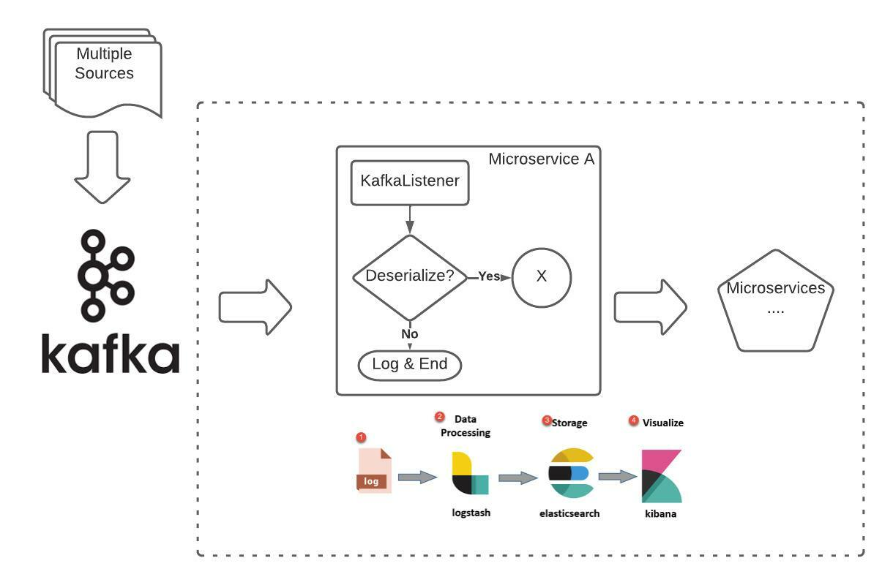

# Getting Started

## Objective
- What is Model Mapper and why is it useful?
- Model Mapper - Not a basic implementation

### Why this video?
- Examples were basic.
- It was not clear for me how to use it correctly.
- I faced some issues with Model Mapper

## Out of the scope
General overview
* Kafka
* Javax validation
* Jackson -> ObjectMapper

#Model mapper
## What is Model Mapper
Model mapper is Java Bean to Java Bean mapper framework that recursively copies data from one object to another,
property by property, field by field.

* Reduce code verbosity.
* Single configuration point.
* Implement sophisticated mapping between two different models.
* Make work easier.

- [Documentation](http://modelmapper.org/user-manual/)
- [Converters](http://modelmapper.org/user-manual/converters/)

## Implementation
* We will receive a message, in this example it will be a JSON string that should respect the contract/agreement.
  - For this example we will use REST endpoints for simplicity, nonetheless, original challenge was with Kafka and that the message was in an array of bytes.
* From that JSONNode we will convert everything (using Jackson/object mapper) to a GenericMessage where all attributes are String.
  - Dates, collections (sets, maps, list, etc), enums, everything will be a string

##Model

### Contract - Class model
```
- title - Text - String
- messageDataType - Text - String 
- createdAt - Date & time - LocalDateTime
- executionTime - Date & time - LocalDateTime
- isActive - true/false - Boolean
- senders - Unique list of sources - Set<String>
- data - All data from original message - Map<String, Object>
```

### Old school
This is a small Java bean/POJO/Model, there could be much more attributes.
```
Message messageOldSchool = Message.builder()
            .messageDataType("TEST-MESSAGE")
            // .createdAt(payload.get("created_at")) -> Implement a method to transform to date format
            .isActive(Boolean.getBoolean(payload.get("isActive").toString()))
            .senders(Set.of("REST-API"))
            .data(payload)
            .build();
```

### Model mapper
```
//From String to Map using Jackson/Object mapper
Map data = objectMapper.readValue(payload, Map.class);

//From Map to GenericMessage - Ignore general formats.
GenericMessage genericMessage = modelMapperV2.map(data, GenericMessage.class);

//From MessageDto to Message - Dates and formats should be validated.
Message message = modelMapperV2.map(genericMessage, Message.class);
```

## Why this complex implementation? High level design



I was working with Kafka (not covered in this tutorial).
* @KafkaListener -> Configure `Topic, groupId and containerFactory`
* containerFactory expects `ConcurrentKafkaListenerContainerFactory`
* ConcurrentKafkaListenerContainerFactory expects `ConsumerFactory`
* ConsumerFactory is where we will set and configure the `Deserializer`

* Deserializer
  * A class `MessageDeserializer implements Deserializer<Message>`
  * It will be necessary to `@override` two methods
    - T deserialize(String var1, byte[] var2)
    - T deserialize(String topic, Headers headers, byte[] data) <- This is the method I was working on!

* From byte array to our expected Message Object
  * Converted byte[] data to a Map -> `return objectMapper.readValue(StringUtils.newStringUtf8(data), Map.class)`
  * Map object to our GenericMessage object -> `objectMapper.convertValue(map, GenericMessage.class)`
  * Finally, used Model Mapper to map everything to our expected final object -> `modelMapper.map(genericMessage, Message.class)`

## Tools
- [IntelliJ](https://www.jetbrains.com/idea/)
- [Maven](https://maven.apache.org/)
- [Spring-boot](https://spring.io/projects/spring-boot)
- [Model Mapper](http://modelmapper.org/)
- [Lombok](https://projectlombok.org/)
- [Postman](https://www.postman.com/)

## Author
Contributors and contact info  
Gustavo Leyva
* [Twitter](https://twitter.com/ovatleyva)
* [GitHub](https://github.com/gusleyva)